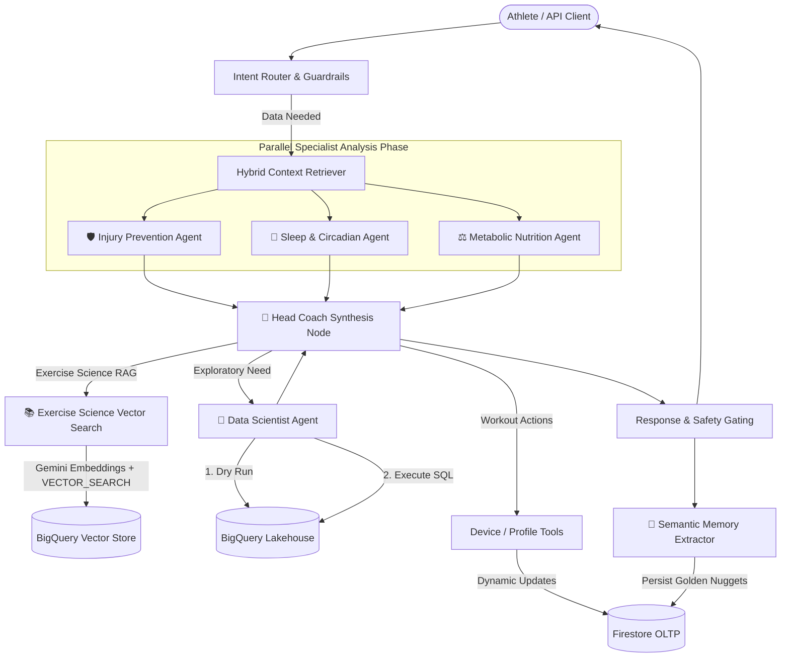

# 🏃 Biometric AI Platform: Multi-Agent Sports Physiology Engine

An enterprise-grade, multi-agent sports physiology platform built with **LangGraph**, **FastAPI**, and a **Hybrid GCP Lakehouse (Firestore + BigQuery + BigQuery Vector Search)**.

The platform continuously analyzes endurance athlete telemetry (heart rate, power, Ground Contact Time, vertical oscillation, HRV, sleep) to provide personalized, science-grounded coaching, prevent overtraining, and automatically synchronize structured workouts to Garmin devices.

---

## 📸 See It In Action (Example Prompts)

Experience how the AI Coach reasons across multiple biometric domains. Run these in your preferred client or via the REST API.

### 1. Holistic Recovery & Readiness (Gemma 4 31B)
> *"Look at my sleep quality from last night and my HRV trend. Given today's workout, am I ready for a high-intensity session tomorrow?"*  
*Highlights: Multi-domain parallel fan-out (Sleep + Injury + Nutrition).*  


### 2. Deep Telemetry & Sprint Analysis (Gemma 4 31B)
> *"Analyze my last run activity. How was my efficiency during that final sprint?"*  
*Highlights: Mechanical cost vs. power output, Ground Contact Time drift.*  


### 3. Scientific Grounding (BigQuery Vector Search RAG)
> *"Explain the 'Polarized 80/20' model and why you keep warning me about the 'Gray Zone.' Use my recent data to show my Z3 time."*  
*Highlights: BigQuery Vector Search with Gemini Embeddings (`gemini-embedding-001`).*  


---

## 🏛️ Architecture Overview

The platform uses a **Parallel Multi-Agent Fan-Out** topology powered by **LangGraph**:



---

## 🚀 Key Architectural Features

- **Parallel Multi-Agent Topology:** LangGraph fan-out execution across specialized agents (**Injury Prevention**, **Sleep & Circadian**, **Metabolic Nutrition**), cutting inference latency by ~60%.
- **BigQuery Vector Search RAG:** Scientific literature RAG powered by `VECTOR_SEARCH` (COSINE distance) and `gemini-embedding-001` embeddings over exercise science research.
- **SQL-Native ACWR Engine:** BigQuery View (`view_calculated_training_status`) computing rolling 7-day Acute and 28-day Chronic Workload Ratios (Power kJ & TRIMP) dynamically.
- **Immune Radar (Statistical Detection):** Proactive stress monitoring using 21-day rolling Z-scores of HRV and Resting Heart Rate to flag early signs of illness or overreaching.
- **Hybrid Lakehouse (SRE Optimized):**
  - **Firestore (OLTP):** Sub-second ACID source of truth for user profiles, HR zones, active goals, and semantic golden nuggets.
  - **BigQuery (OLAP):** High-throughput analytical data lake storing FIT time-series telemetry and FinOps audit logs.
- **SRE Cost Guardrails:** The Data Scientist agent executes BigQuery dry runs before querying, enforcing a **500 MB scan ceiling** to prevent cloud cost overruns.
- **Semantic Memory Extractor:** Captures factual constraints (injuries, preferences, gear) post-session and persists them in Firestore.
- **Leak-Proof ETL Pipelines:** Ingestion jobs (`etl_job.py`) process incremental deltas with strict `try...finally` staging table lifecycles.
- **FinOps Audit Logging:** Tracks model tokens, execution latency, and estimated USD cost per invocation (`finops_logs`).

---

## 📚 Documentation Index

For detailed guides, architecture plans, and API specs, explore our [Docs Index](docs/README.md):

- [🚀 Getting Started Guide](docs/guides/getting-started.md) — Local installation & environment setup.
- [📐 System Architecture Overview](docs/architecture/system-overview.md) — Multi-agent graph, agent mandates, and topology.
- [🗄️ Database Architecture](docs/architecture/database-design.md) — Firestore OLTP, BigQuery OLAP, and ACWR view logic.
- [🛡️ SRE & Observability Standards](docs/architecture/sre-and-observability.md) — Dry-run guardrails, OpenTelemetry, and FinOps audit logs.
- [🛠️ Developer Guide](docs/guides/developer-guide.md) — Testing (`pytest`), linting (`ruff`), and typing (`mypy`).
- [🔌 External Agent API Guide](docs/guides/external-agent-api-guide.md) — REST API endpoints and multi-tenant `X-User-ID` headers.

---

## ⚡ Quick Start

### 1. Installation & Dependencies
```bash
git clone https://github.com/restrok/biometric-ai-platform.git
cd biometric-ai-platform/api
uv sync
```

### 2. Environment Setup
Create a `.env` file in `api/`:
```env
GOOGLE_CLOUD_PROJECT=bio-intelligence-dev
GOOGLE_APPLICATION_CREDENTIALS=/path/to/credentials.json
LLM_PROVIDER=google
CORE_MODEL_NAME=gemma-4-31b-it
DS_MODEL_NAME=gemma-4-31b-it
```

### 3. Run Quality Verification & Tests
```bash
# Run pytest suite
PYTHONPATH=. uv run pytest

# Check code formatting & types
uv run ruff check
uv run mypy .
```

### 4. Start the Service
```bash
uv run python main.py
```
*Access the interactive API documentation at: `http://localhost:8000/docs`*
