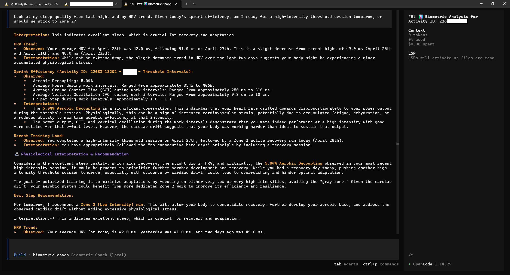
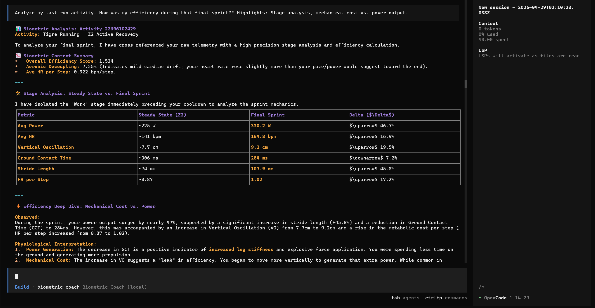
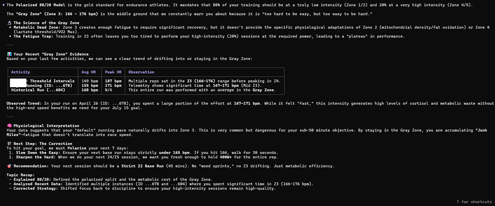
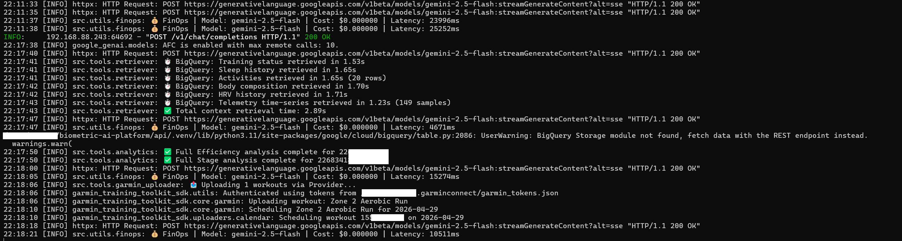

# 🏃‍♂️ Biometric AI Platform
**The World's First Agentic AI Running Coach Powered by Your Raw Telemetry**

Stop guessing with generic training plans. The **Biometric AI Platform** transforms your fitness data into a Product-Grade AI Ecosystem. By ingesting second-by-second telemetry into a high-performance Lakehouse, our brand-agnostic AI agent analyzes your form, cardiovascular drift, and recovery state to prescribe truly personalized, science-backed coaching.

---

## 📸 See It In Action (Example Prompts)

Experience how the AI Coach reasons across multiple biometric domains. Run these in your preferred OpenAI-compatible client (like OpenCode or Chatbox).

### 1. Holistic Recovery & Readiness (Gemini 3.1 Flash Lite)
> "Look at my sleep quality from last night and my HRV trend. Given today's workout, am I ready for a high-intensity session tomorrow?"
*Highlights: Multi-domain context retrieval (Sleep + HRV + Activity).*


### 2. Deep Telemetry & Sprint Analysis (Gemini 3.1 Flash Lite)
> "Analyze my last run activity. How was my efficiency during that final sprint?"
*Highlights: Stage analysis, mechanical cost vs. power output.*


### 3. Scientific Grounding (RAG) (Gemini 3.1 Flash Lite)
> "Explain the 'Polarized 80/20' model and why you keep warning me about the 'Gray Zone.' Use my recent data to show my Z3 time."
*Highlights: BigQuery Vector Search and exercise science principles.*


### 4. Mechanical vs. Metabolic Efficiency
> "Compare the 'HR per Step' and 'Ground Contact Time' of my last run vs. last week. Am I becoming more efficient?"
*Highlights: Long-term trend analysis and mechanical form metrics.*

### 5. Goal-Driven Planning & Action
> "My goal is sub-50 mins on July 15. Build a 4-workout block for next week that prioritizes my lactate threshold and sync it to my calendar."
*Highlights: Complex planning and automated device synchronization.*

---

## 🛠️ Developer Visibility & Integration

The platform is built for transparency and ease of integration, providing sub-second feedback for both the athlete and the engineer.

### Real-time Telemetry Logs
Every request triggers a high-precision reasoning loop. Our backend logs detailed telemetry stages and FinOps costs (tokens, latency, USD) in real-time.


### Client Integration: OpenCode (Harness)
Because the API is fully OpenAI-Compatible, you can plug your AI Coach into professional development tools like **OpenCode** in seconds.

**Example `.opencode/opencode.json`:**
```json
{
  "$schema": "https://opencode.ai/config.json",
  "provider": {
    "lmstudio": {
      "npm": "@ai-sdk/openai-compatible",
      "name": "Biometric Coach (Local)",
      "options": {
        "baseURL": "http://<YOUR_PI_IP>:8000/v1"
      },
      "models": {
        "biometric-coach": {
          "name": "biometric-coach"
        }
       }
    }
  }
}
```

---

## ✨ Why Choose Biometric AI?

### 🔬 Science-Backed, Not Generic
Generic plans don't know when you slept poorly. Our AI Coach uses **Agentic RAG (Retrieval-Augmented Generation)** grounded in exercise physiology to dynamically adjust your training based on the **Polarized (80/20) Model**.

### 🫀 Second-by-Second Telemetry Analysis
We don't just look at your average heart rate. The platform analyzes your **Ground Contact Time (GCT), Vertical Oscillation, and Power (Watts)** to detect subtle form breakdowns and Aerobic Decoupling (Cardiac Drift)—catching fatigue before it becomes an injury.

### 🛡️ Safety & Intelligence First
- **The "3-Run Rule":** The AI won't overreact to a single "hero run" or a bad day. It looks for reproducible physiological evidence across multiple activities before shifting your zones.
- **Smart Calibration:** New to the platform? The engine initiates a "Discovery Mode," prescribing easy runs until your unique baseline is established.
- **Recovery Overrides:** If your HRV tanks or your Sleep Score drops below 60, the AI intervenes, prioritizing rest over performance goals.

---

## 💎 Quality & Standards

This project maintains high engineering standards to ensure reliability and performance.

- **Type Safety:** All Python code is strictly typed and verified using `mypy`.
- **Linting & Formatting:** We use `ruff` for ultra-fast Python linting and formatting.
- **Infrastructure Safety:** Terraform configurations are formatted and validated with `terraform fmt`.
- **English Standard:** All documentation, comments, and code are written in professional US English.

---

## 🚀 Key Features
- **Parallel multi-agent Topology:** Optimized LangGraph orchestration. Specialist agents (**Injury, Sleep, Nutrition**) execute in parallel (Fan-out/Fan-in), reducing request latency by ~60%.
- **Immune Radar (Statistical Detection):** Proactive health monitoring using **Z-Scores** (Standard Deviations). Detects systemic stress and impending illness by analyzing 21-day rolling averages of HRV and RHR.
- **Hybrid Storage Engine (SRE Optimized):** Separates concerns using the [OLTP vs. OLAP Design Guidelines](./docs/database-design-guidelines.md):
    - **Firestore (OLTP):** Ultra-low latency source of truth for agent context, user profiles, and active goals.
    - **BigQuery (OLAP):** High-performance data lake for massive telemetry analysis and historical intelligence.
- **SRE-Driven Data Science:** The Data Scientist agent autonomously evaluates BigQuery **Dry Runs** to estimate query costs and optimize partitioning before execution.
- **Semantic Conversation Memory:** Persists factual "Golden Nuggets" (preferences, constraints, quirks) across sessions in Firestore, ending the "goldfish effect" of standard LLMs.
- **Autonomous Discovery Phase:** Background engine that proactively audits the last 30-90 days of data during each sync to find hidden patterns and persistent 'Success Markers'.
- **Asynchronous Onboarding:** Automated 90-day historical backfill for new users triggered via Firestore state, ensuring a seamless first-run experience without blocking the agent.
- **Pre-Flight Health Scan:** Mandatory safety gating that cross-references A:C Ratio, HRV, and subjective logs before prescribing any workout.
- **Universal Hardware Support:** Built on an LLM-Native SDK (`garmin-training-toolkit-sdk`), allowing seamless integration with Garmin.
- **Zero-CLI Dynamic Auth:** Link your Garmin account directly through the chat interface using secure SSO.

---

## 📚 Documentation

Want to look under the hood or set this up for yourself? We have you covered:

- [🚀 Getting Started (Setup & Installation)](docs/getting-started.md)
- [🛠️ Developer Guide (Architecture & Workflows)](docs/developer-guide.md)
- [🏗️ Docker Deployment](#-docker-deployment)

---

## 🏗️ Docker Deployment

The platform is fully containerized for easy deployment on home servers or Raspberry Pis.

### Prerequisites
- Docker and Docker Compose installed.
- Your `.env` file configured in `api/`.
- Your `garmin_tokens.json` initialized (if not using Secret Manager).

### Quick Start
```bash
# Start the API and the background token refresh loop
docker-compose up -d --build
```

The API will be available at `http://localhost:8000`. The container includes an automatic hourly token refresh loop to ensure your session remains active without manual intervention.

---
- [📐 Architecture Plan](docs/architecture-plan.md)
- [🎯 Project Goals](docs/goal.md)
- [🗺️ Development Roadmap](docs/roadmap.md)

---

## ⚡ Get Started

Ready to train? The full installation takes about 5 minutes. See the [🚀 Full Setup Guide](docs/getting-started.md) for detailed instructions.

### 1. Install & Environment
```bash
git clone https://github.com/restrok/biometric-ai-platform.git
cd biometric-ai-platform/api
uv sync
```
*Note: Create a `.env` in `api/` with your `GOOGLE_CLOUD_PROJECT` and `GOOGLE_API_KEY`.*

### 2. Authenticate & Ingest
```bash
# Generate your Garmin session tokens
uv run python -m garmin_training_toolkit_sdk.auth

# Sync your historical data to BigQuery
PYTHONPATH=src uv run python src/tools/etl_job.py
```

### 3. Start the AI Coach
```bash
uv run python main.py
```
*Access the interactive API console at: `http://localhost:8000/docs`*
