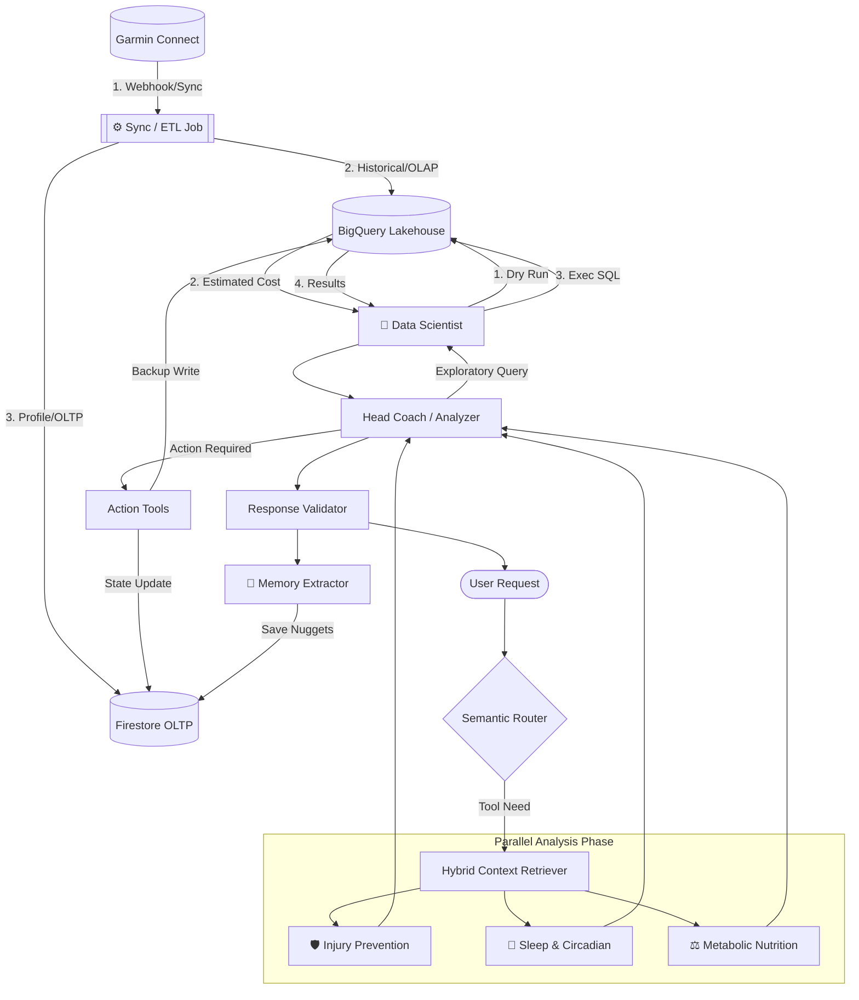

# Architecture Plan V1: Transition to AI Infrastructure Platform

This document consolidates the technical and architectural strategy to evolve the current `garmin-training-toolkit` into a production-level AI Platform, aligned with the goal of demonstrating Infrastructure Engineering and FinOps capabilities.

## 1. Repository Strategy (The Split)

We have decided to adopt a **Separate Repositories** approach to ensure a clear and professional separation of concerns:

*   **Repo 1: The Data Extractor (Current `garmin-training-toolkit`)**
    *   **Role:** Function exclusively as an Ingestion SDK/Library (Data Connector).
    *   **Responsibility:** Authenticate with Garmin, handle rate limits, extract raw data (.FIT, JSON), and validate it against strict schemas.
    *   **Does not include:** AI logic, LLM models, vector databases, or cloud infrastructure.
*   **Repo 2: The AI Platform (Future, e.g., `biometric-ai-platform`)**
    *   **Role:** The Core Agentic RAG system and SRE Infrastructure.
    *   **Responsibility:** Orchestrate Agents (LangGraph), expose the API (FastAPI), handle Terraform/GCP, and evaluate quality (Ragas).
    *   **Interaction:** Consumes the structured data generated by Repo 1 via the **Standardized Provider Interface**.

## 2. Standardized Provider Interface (The "Common Language")

To support a multi-brand future (Garmin, Suunto, Whoop), we have implemented a **Provider Pattern** that abstracts proprietary brand logic:

*   **Base Provider (ABC):** Defines a strict contract for extraction (`get_activities`) and action (`upload_training_plan`).
*   **Protocol Layer:** A brand-agnostic set of Pydantic models (Activity, Telemetry, Workout) that uses **Semantic Naming** (e.g., `min_target` instead of `targetValueOne`).
*   **Agent Tool Factory:** Standardized tools are generated from any provider, ensuring the AI Agent sees the same schema regardless of the underlying hardware.

## 3. Persistent Biometric Profile (Dynamic Tuning)

The platform has moved beyond static analysis to **Dynamic Profile Persistence**:

*   **Discovery:** The agent analyzes second-by-second telemetry to detect physiological thresholds (e.g., Aerobic Threshold).
*   **Persistence:** The agent uses the `update_user_zones` tool to write these discoveries back to the BigQuery `user_profile` table.
*   **Retrieval:** The `retriever` tool prioritizes these custom empirical zones over generic age-based formulas.

## 4. Control Systems & Feedback Loops

To ensure the platform remains stable and safe, we treat biometric analysis as a **Closed-Loop Control System**:

### Noise Reduction & Stability
- **Smoothing Filter:** Instead of reacting to a single activity, the agent implements a "Low-Pass Filter" by analyzing a multi-activity window (last 3-5 runs).
- **Trend Verification:** Changes to the `user_profile` (like zone updates) require reproducible evidence across multiple high-duration segments (>45 mins) to prevent overreacting to daily fluctuations or sensor errors.

### Cold Start Protocol (Discovery Mode)
The system handles the "First User" problem through a tiered onboarding process:
1.  **Stage 1 (Baseline):** Collection of "Normal Life" metrics (Sleep, Resting HR, Weight).
2.  **Stage 2 (Calibration):** A 2-week mandatory Zone 2 period to log initial telemetry.
3.  **Stage 3 (Personalization):** Transition to full prescription once the agent detects a stable Aerobic Threshold.

## 5. Cost-Zero Development Strategy (FinOps)

To keep costs controlled during the development phase, the architecture will be designed under the premise **"Local First, Cloud for Production"**:

*   **Vector DB:** Use of `LanceDB` or `ChromaDB` in embedded/local mode.
*   **LLM:** Use of APIs with Free Tiers (Gemini, Groq) or local models (Ollama) for "Reasoning Loop" development.
*   **Infrastructure (GCP):** We will write the IaC (Terraform) in Repo 2 to demonstrate SRE capabilities, but execution (`terraform apply`) will be postponed until the final validation phase.

## 4. Execution Next Steps (Action Items)

1.  Initialize modern dependency management (e.g., with `uv`).
2.  Create the `garmin_toolkit` directory and relocate `auth.py` and common utilities.
3.  Define the first Pydantic models in `garmin_toolkit/models/` based on observed API responses.
4.  Refactor `collector.py` logic, separating it by domain within the `extractors/` folder.

## 5. Monorepo Implementation (Update)

Following the initialization of the `biometric-ai-platform` repository, the following directory structure has been implemented, consolidating the separation between Infrastructure (Terraform) and Backend (API):

```text
biometric-ai-platform/
├── README.md                     # Main repository documentation
├── docs/                         # Architectural documentation (this directory)
├── api/                          # AI Engineering & Backend (Python with uv)
│   ├── pyproject.toml            # Dependency management
│   ├── src/
│   │   ├── agent/                # LangGraph nodes and routers
│   │   └── tools/                # Interaction tools for the LLM
│   └── tests/                    # Evaluation pipelines with Ragas
└── infrastructure/               # SRE / Infrastructure as Code (Terraform)
    ├── modules/                  # Reusable modules
    │   ├── iam/                  # Identity and Access Management
    │   ├── network/              # VPC and Private Endpoints
    │   └── storage/              # GCS, Artifact Registry, BigQuery
    ├── envs/                     # Environment-specific variables
    │   └── dev.tfvars            # Variables for development
    ├── main.tf                   # Main workspace
    └── variables.tf              # Global variable definitions
```

This structure allows SRE teams to work centrally in `infrastructure/` while AI Engineers develop the FastAPI server and agents in `api/`.

## 6. Storage Architecture (Hybrid Lakehouse): Firestore (OLTP) & BigQuery (OLAP)

To ensure high performance for AI workloads while strictly adhering to Google Cloud's Free Tier limits, the platform utilizes a **Hybrid Storage Architecture**. This design follows the [Database Design Guidelines](./database-design-guidelines.md) to separate real-time state from analytical history.

### Firestore: Transactional & State Layer (OLTP)
Firestore serves as the primary source of truth for the real-time operational functioning of the agents.
*   **User Profiles & Zones:** Real-time athlete parameters and heart rate zones.
*   **Operational State:** Control flags like `full_etl_synced` and active session tokens.
*   **Active Goals & Health Status:** Immediate subjective context and current training targets.
*   **Semantic Memory (`user_memories`):** Factual "Golden Nuggets" extracted from conversations.
*   **Personal Calibration Profile (PCP):** Discovered physiological markers (e.g., lactate thresholds).

### BigQuery: Analytical & Data Lake Layer (OLAP)
BigQuery serves as the immutable data lake for massive analysis and historical intelligence.
*   **Pure Biometric Telemetry:** High-resolution time-series of HRV, RHR, and activity metrics.
*   **Historical Execution Logs:** Traceability of agent responses and FinOps metrics.
*   **Physiological Aggregations:** Pre-calculated rolling averages used for statistical anomaly detection (e.g., 21-day baselines).

### Data Pipeline & Synchronization
*   **Incremental Sync:** The ETL job fetches only new data (deltas) based on BigQuery's `MAX(date)`.
*   **Asynchronous Onboarding:** For new users, a 90-day historical backfill is triggered asynchronously in the background via Firestore state management, ensuring the proactive loop remains unblocked.
*   **Dual-Write Pattern:** Operational tools (e.g., `update_user_zones`) perform low-latency writes to Firestore while asynchronously maintaining historical consistency in BigQuery.

## 7. AI Reasoning & Personalization (Advanced Agentic RAG)

The platform implements a sophisticated reasoning layer in LangGraph that bridges generic scientific formulas and individual athlete reality:

*   **Data-Driven Customization:** The agent prioritizes observed data (e.g., a real Max HR of 196 bpm found in telemetry) over standard formulas (like 220-age).
*   **Subjective Integration:** The agent integrates user feedback (e.g., "I feel sick", "I have back stress") via the **User Health Status** table. This subjective context is persisted in BigQuery and retrieved in every session to ensure contextually aware coaching (e.g., suggesting rest during a cold).
*   **Longitudinal Analysis:** The platform supports **Interannual Analysis** through a date-aware retriever, allowing the agent to compare seasonal performance (e.g., April 2025 vs. April 2026) and quantify long-term fitness gains.
*   **Detailed Telemetry Analysis:** The retriever provides compact, high-signal second-by-second summaries of the last 3 activities. This allows the AI to autonomously detect complex physiological trends like **Aerobic Decoupling** and **Efficiency Leaks**.
*   **Precision Context Retrieval:** The `retriever` tool has been optimized to merge redundant BigQuery calls into comprehensive domain-aware queries, significantly reducing latency and operational cost.
*   **High-Performance Execution:** Context retrieval is optimized using `ThreadPoolExecutor` for parallel BigQuery queries. Inference is powered by `gemini-3.1-flash-lite`, driving low request latencies.

## 8. Current Project State & Accomplishments

*   **SDK Integrated:** `garmin-toolkit` linked via `uv` as a local project dependency.
*   **Fail-Safe Pipeline:** ETL handles missing data gracefully.
*   **Zero-Cost Production Ready:** The entire stack runs within GCP Free Tier and Google AI Studio Free Tier (Gemini 3.1 Flash Lite).
*   **Infrastructure as Code:** Terraform modules ready for Storage, IAM, and Service Accounts.

## 11. Specialized Parallel Multi-Agent Topology (LangGraph)

To reduce latency and improve reasoning depth, the platform utilizes a **Parallel Multi-Agent Architecture**. This topology leverages LangGraph to trigger domain-specific experts simultaneously (Fan-out) before synthesizing a unified response (Fan-in).

### Agent Roles & Specialized Mandates
*   **🛡️ Injury Prevention Agent:** Monitors mechanical risk and volume progression. Calculates A:C Ratios and detects form breakdown (GCT drift).
*   **🧬 Sleep & Circadian Agent:** Analyzes recovery quality. Implements the **Immune Radar** using Z-scores of HRV and RHR to detect systemic stress/impending illness.
*   **⚖️ Metabolic Nutrition Agent:** Calculates energy cost and replenishment strategies based on real activity intensity.
*   **🧪 Data Scientist Agent:** Autonomously executes exploratory SQL. Follows an **SRE Dry Run Mandate** to evaluate query cost before execution, ensuring efficient data operations.
*   **🧠 Semantic Memory Extractor:** Silently captures "Golden Nuggets" from interactions and persists them in Firestore for cross-session continuity.

### System Workflow (Parallel Flow)


## 12. Persistent Physiological Memory (Autonomous Discovery)

The system now implements a **Proactive Discovery Loop**. During every synchronization cycle, the **Data Scientist** agent performs an autonomous audit of the user's historical data (30-90 days). 

1.  **Continuity Check:** Reads existing Success Markers from the `user_calibration_profile` (Firestore).
2.  **Hypothesis Testing:** Executes exploratory queries to find shifts in physiological truths (e.g., "Is my heat sensitivity improving?").
3.  **Persistence:** Updates numerical values and context in BigQuery and Firestore, ensuring that the **Head Coach** has immediate access to these 'rare' insights during real-time planning without re-calculating them.

## 13. Architectural Challenges & Mitigations (Feedback Loop)

Based on architectural reviews, the following design decisions address key distributed systems and LLM orchestration challenges:

### 1. The Dual-Write "Eventual Consistency" Risk
**Challenge:** The system writes operational state to Firestore and historical data to BigQuery. If the BQ worker fails, the systems desync.
**Mitigation:** The system relies on an **ETL Self-Healing Mechanism** rather than strict distributed transactions. Firestore acts as the ultimate source of truth for immediate coaching state. The BigQuery synchronization (`sync_biometric_data`) operates on a delta-fetch based on BigQuery's `MAX(date)`. If a write fails, the next sync cycle will naturally pick up the missing delta, effectively acting as an asynchronous outbox pattern without the operational overhead.

### 2. Context Window Bloat in Fan-In (Head Coach)
**Challenge:** In the parallel topology, the Head Coach receives context from the Retriever plus reports from three specialist agents. If specialists output verbose text, the Head Coach's prompt becomes diluted, increasing cost and reducing attention precision.
**Mitigation:** To preserve clinical precision without the token bloat, specialists are constrained to **High-Signal Structured Outputs (Noise Reduction)**. 
* Specialists do not reiterate raw metrics (as the Head Coach already has the `biometric_context`).
* Specialists output strictly formatted internal reports containing only derived insights (e.g., calculated Z-scores, physiological interpretation, and hard constraints).
* This eliminates conversational filler while maintaining 100% of the rigorous analytical depth required for the final synthesis.
