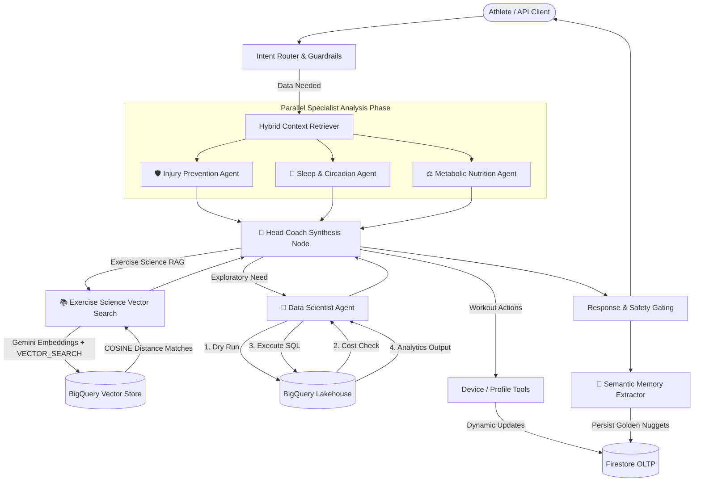

# System Architecture & Multi-Agent Overview

The **Biometric AI Platform** is an enterprise-grade, multi-agent sports physiology platform built on **LangGraph**, **FastAPI**, and a **Hybrid GCP Lakehouse (Firestore + BigQuery + BigQuery Vector Search)**. 

It acts as an autonomous AI Head Coach for endurance athletes, coordinating specialized agents to analyze telemetry, calculate workload stress, monitor autonomic recovery, and prevent injury.

---

## 1. Multi-Agent Topology & Control Flow

The platform executes an event-driven, graph-based agent flow orchestrated by **LangGraph**. Requests are dynamically routed based on user intent and processed through parallel analysis, deep exploratory query loops, scientific exercise RAG, and safety validation.

---

## 2. Specialist Agent Mandates & Core Tools

| Component / Tool | Icon | Role & Mandate |
| :--- | :---: | :--- |
| **Injury Prevention** | 🛡️ | Analyzes biomechanical telemetry (Ground Contact Time drift, Vertical Oscillation) and computes Acute:Chronic Workload Ratios (ACWR). Enforces hard safety limits (ACWR > 1.3 blocks high intensity; ACWR > 1.5 forces deload/rest). |
| **Sleep & Circadian** | 🧬 | Evaluates autonomic nervous system recovery (HRV status, Resting Heart Rate drift, sleep architecture). Uses 21-day rolling Z-scores to flag systemic stress precursors. |
| **Metabolic Nutrition** | ⚖️ | Calculates carbohydrate/glycogen depletion based on mechanical power output (kJ) vs. HR zone distribution, providing targeted post-run fueling recommendations. |
| **Exercise Science RAG** | 📚 | Performs `VECTOR_SEARCH` against BigQuery vector store using `gemini-embedding-001` embeddings to retrieve research-backed methodology (e.g. 80/20 polarized training, cardiac decoupling). |
| **Data Scientist** | 🧪 | Autonomous exploratory agent that formulates and tests hypotheses against the BigQuery Data Lake. Operates under an SRE Dry-Run Mandate to prevent costly full-table scans. |
| **Head Coach Synthesis** | 🧠 | Core reasoning node that synthesizes reports from all specialist agents into actionable, tailored advice or structured Garmin workout plans. |
| **Semantic Memory Extractor** | 🧠 | Post-processing node that captures long-term factual constraints (injuries, preferences, gear setup) and saves them as golden nuggets in Firestore. |

---

## 3. Multi-Tenant Isolation & Security Model

- **Strict Identity Ingestion:** Every request requires an authenticated `user_id` passed via headers (`X-User-ID`) or state context.
- **Tool-Level Gating:** All database retrieval tools, Firestore operations, and BigQuery SQL queries inject `WHERE user_id = '{user_id}'` filters programmatically.
- **Prompt Injection Defense:** Input text is sanitized and wrapped in system isolation prompts before reaching LLM execution nodes.
