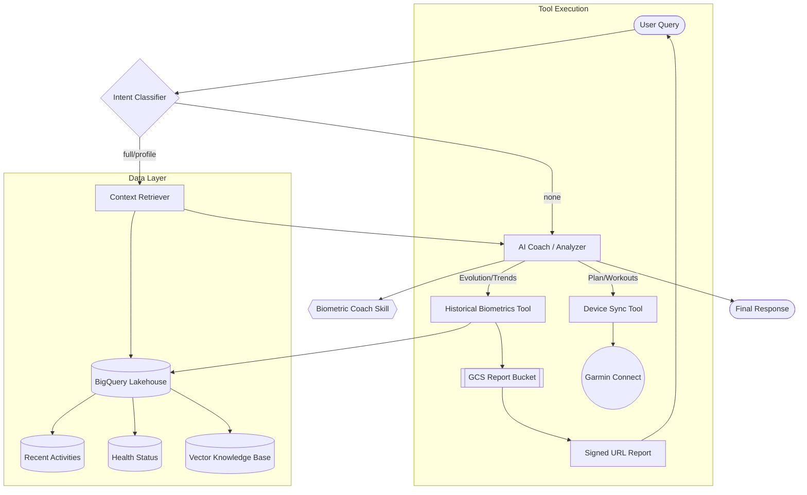
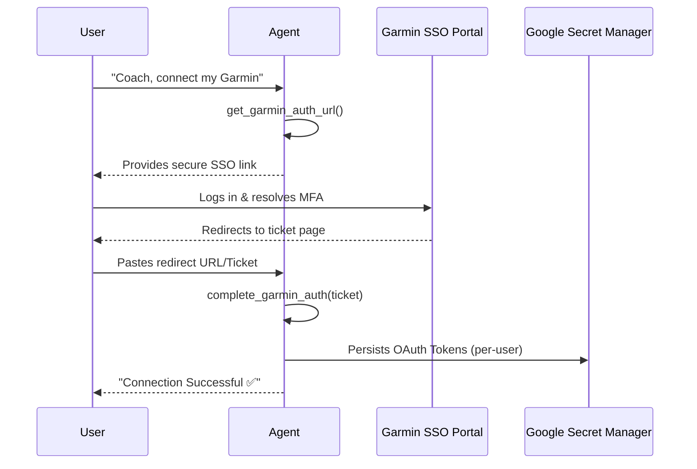

# 🛠️ Developer Guide

This guide explains the internal architecture and development workflows for the Biometric AI Platform.

## 🏗️ Core Architecture

The platform is designed as an **Agentic RAG** system, decoupled into several specialized layers.



### 1. Data Layer (BigQuery Lakehouse)
*   **Native Tables:** All biometric data is stored in Native BigQuery tables for sub-second retrieval.
*   **Schema Consistency:** The `etl_job.py` enforces schema rules (e.g., casting `run_walk_index` to float) to prevent load failures.
*   **Vector Database (RAG):** We use BigQuery's native `VECTOR_SEARCH` capabilities for the exercise science knowledge base.
    *   **Implementation:** The knowledge base is stored in the `biometric_data_dev.knowledge_base` table.
    *   **Embeddings:** We use the `models/gemini-embedding-001` model via Google Generative AI to generate 768-dimensional embeddings for Markdown chunks.
    *   **Knowledge Sync (`upload_knowledge.py`):** This script manages the RAG data lifecycle. It uses `DirectoryLoader` to parse Markdown files, `RecursiveCharacterTextSplitter` (chunk size 1000, overlap 100) for chunking, and uploads the results to BigQuery.
    *   **Retrieval:** The agent uses a `search_knowledge_base` tool that performs a `VECTOR_SEARCH` on BigQuery using the user query's embedding.

### 2. SDK Layer (`garmin-toolkit`)
*   Acts as an **Anti-Corruption Layer**.
*   Implements a **Standardized Provider Interface** (Provider Pattern) to support multiple hardware brands.
*   **LLM-Native Models**:
    - **`RepeatGroup`**: Enables concise definition of interval sessions (e.g., 10x400m) in a single JSON block.
    - **Strongly Typed Targets**: Uses `HeartRateTarget`, `PaceTarget`, and `PowerTarget` with explicit fields (e.g., `min_bpm`) to remove ambiguity.
    - **Auto-Conversion**: The SDK handles the heavy lifting of converting high-level LLM intent (minutes, meters) into proprietary brand requirements (seconds, m/s).
*   **Introspection capabilities**: Extends the provider interface with `get_workout_templates()` to allow querying the user's established workout library efficiently.

### 3. Reasoning Layer (Agent Skills)
The platform's intelligence is modularized into **Skills**.
*   **`biometric-coach` Skill**: A portable set of instructions (`SKILL.md`) that transforms any agentic framework into an Exercise Physiologist.
*   **Multi-Tenancy Support**: The reasoning layer is user-aware. It extracts `user_id` from the `AgentState` (populated via the `X-User-ID` request header) to isolate data retrieval and device synchronization.
*   **Ethical & Precision Protocol**: Mandatory rules for separating data facts from physiological interpretation and avoiding overconfidence.
*   **State Graph Nodes (`api/src/agent/graph.py`):**
    - `retriever`: Fetches 7 context domains (Activities, Sleep, HRV, Scheduled Workouts, etc.) from BigQuery in parallel.
    - `analyzer`: Uses **Gemini 2.0 Flash** with the coach skill to reason over the retrieved context.
    *   `tools`: Executes external actions. Standard tools include:
        *   `upload_training_plan`: Schedules tailored workouts on the user's device.
        *   `list_workouts`, `batch_remove_workouts`, `prune_unused_workouts`: Advanced workout library management leveraging SDK introspection to prevent capacity limits.
        *   `sync_biometric_data`: Triggers the ETL pipeline to refresh BigQuery.
        *   **update_user_zones**: Persists detected physiological thresholds to the user profile.
        *   **search_knowledge_base**: Native BigQuery vector search for exercise science.
        *   **generate_historical_report**: Computes long-term evolution and exports artifacts to GCS.

### 4. Historical Reporting Architecture
To avoid overwhelming the LLM context with years of data, historical analysis is offloaded to a specialized tool:
1.  **Computation**: The tool queries BigQuery for the full user history and calculates physiological metrics (Acute/Chronic Load, Efficiency Z-Scores).
2.  **Artifact Generation**: A detailed Markdown report is generated and uploaded to a private GCS bucket.
3.  **Secure Access**: The tool returns a **Signed URL** (valid for 1 hour) and a high-level summary.
4.  **Lean Context**: The agent only sees the summary, keeping the conversation fast and token-efficient.

### 5. Dynamic SSO Authentication Flow
The platform implements a Zero-CLI authentication model, allowing users to link their Garmin accounts directly through the chat interface.



### 6. Secret Management & Token Persistence
*   **Encrypted Storage:** All Garmin OAuth tokens are stored in **Google Secret Manager** using the naming convention `garmin-tokens-{user_id}`.
*   **Automated Lifecycle:** A background loop in `api/main.py` refreshes all active user sessions every 2 hours, rotating `di_client_id` to ensure high availability and pushing updated tokens back to the cloud.
*   **Zero-State Architecture:** The API is designed to be stateless; it can be restarted or redeployed without losing user sessions as long as GCP Secret Manager is accessible.

### 7. Intelligence Implementation (Safety & Stability)

        *   **Noise Reduction (Windowing):** The `analyzer` node is prompted to look for reproducibility. It must compare multiple telemetry segments from the `retriever` before suggesting a profile update.
        *   **Cold Start Logic:** If `biometric_context['recent_activities']` is empty or only contains info messages, the `analyzer` is programmed to switch to "Calibration Mode." It will refuse to call `upload_training_plan` with high-intensity workouts and instead recommend a 2-week baseline-gathering phase.
        *   **Scientific Grounding:** The system uses the `Karvonen Formula` as a fallback when empirical Aerobic Threshold (AeT) data is unavailable.

        ---

        ## 🛠️ Development Workflows


### 1. Adding a New Tool
1.  Define the tool function in `api/src/tools/`.
2.  Use the `@tool` decorator from `langchain_core.tools`.
3.  Add the tool to the `tools` list in `api/src/agent/graph.py`.
4.  Bind the tool to the LLM and update the `ToolNode`.

### 2. Modifying the System Prompt
The `SYSTEM_PROMPT` is the "brain" of the agent. It is located in `api/src/agent/graph.py`. When updating it:
*   Maintain the **Exercise Physiologist** persona.
*   Keep the **Grounding Rules** for scientific accuracy.
*   Ensure **Response Structure** remains consistent (Tables, Bold Headers).

### 3. Local Debugging
To debug the agent without starting the FastAPI server, use the `reproduce_issue.py` pattern:
```python
from src.agent.graph import graph
initial_state = {"messages": [HumanMessage(content="Query")]}
result = await graph.ainvoke(initial_state)
```

---

## 🚀 Project Operational Rules

### Environment & Tools
- **Python (Runtime):** ALWAYS use `uv run` for script execution or troubleshooting within the `api/` directory. This ensures all dependencies (pandas, pydantic, etc.) are correctly loaded from the virtual environment.
- **Tool Execution:** Internal tools should be invoked via `uv run scripts/manage_tools.py call <tool_name> '<args>'`.
- **BigQuery:** This is the primary source of truth for all historical biometric context. Tables are partitioned by a `user_id` column.
- **Garmin Tokens:** Persisted at `~/.garminconnect/garmin_tokens_<user_id>.json`.
- **Model Discovery:** To check available models and their exact API identifiers (especially when using free-tier keys), use the following command:
  ```bash
  curl "https://generativelanguage.googleapis.com/v1beta/models?key=YOUR_API_KEY"
  ```

### Authentication Setup (Linux/Raspberry Pi)
On headless Linux systems, the browser-based authentication requires manual system setup:
1.  **Install Browser:** `uv run playwright install chromium`
2.  **Install Libraries:** `sudo .venv/bin/python3 -m playwright install-deps`
3.  **Run Auth:** `uv run python -m garmin_training_toolkit_sdk.auth`

---

## 📊 Observability & FinOps
*   **FinOps Logging:** Every LLM call is logged to `biometric_data_dev.finops_logs` in BigQuery.
*   **Tracing:** Tracing can be enabled using LangSmith (optional).
*   **Pricing:** Model costs are defined in `api/src/utils/finops.py`.

---

## 🧪 Testing & Validation
*   **Integration Tests:** Located in `api/tests/test_finops_integration.py` and `api/tests/test_vector_rag.py`.
*   **Evaluation:** Ragas-based evaluation for RAG quality (Context Precision, Faithfulness) is planned.

---

## 🚀 Infrastructure & Deployment

The infrastructure is managed via **Terraform** in the `/infrastructure` directory. It follows a modular architecture for better maintainability and reusability.

### 1. Modular Architecture
*   **`modules/storage`**: Manages the BigQuery datasets and Google Cloud Storage buckets (Data Lake and Terraform State).
*   **`modules/iam`**: Handles Service Account creation and precise IAM role assignments (BigQuery Viewer/JobUser, Storage ObjectViewer).
*   **`modules/secrets`**: Sets up Secret Manager secrets (e.g., `garmin-tokens`, `aistudio-api-key`).
*   **`modules/billing`**: Configures budget alerts and safety caps to prevent unexpected costs.

### 2. State Management
We use a **GCS Backend** for state management, which enables team collaboration and state versioning. 
*   **Partial Configuration**: Sensitive backend details (bucket name) are stored in `backend.tfvars` (local only).
*   **Security**: All `*.tfvars` files are ignored by git. Use `terraform.tfvars.example` as a template.

### 3. CI/CD (Future)
*   The API can be containerized using the provided `Dockerfile` and deployed to **Google Cloud Run**.
*   Workflows are being established in `.github/workflows/ci.yml` for automated testing.
